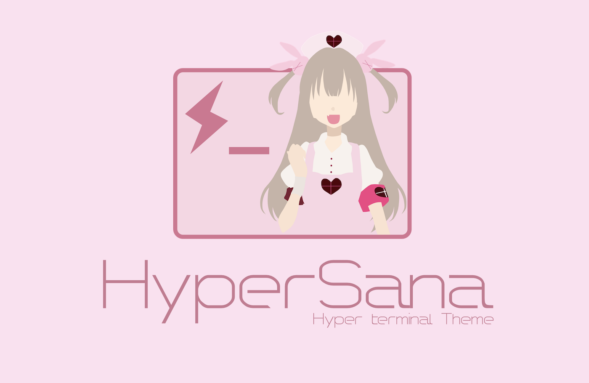
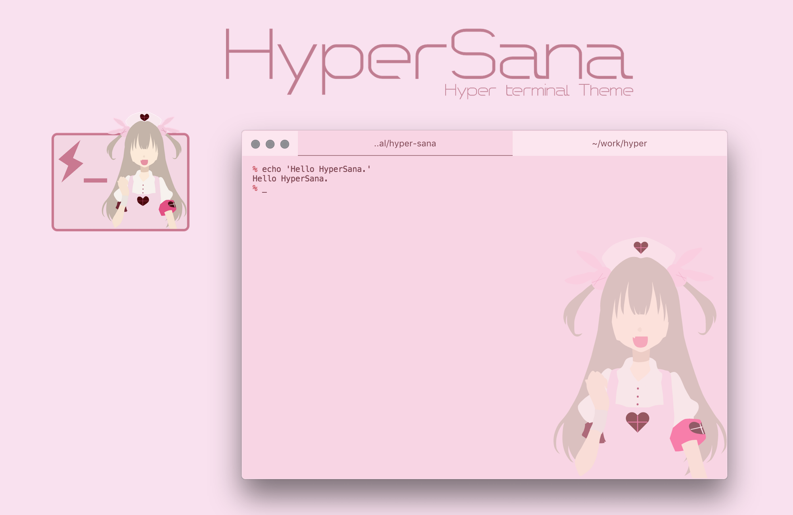
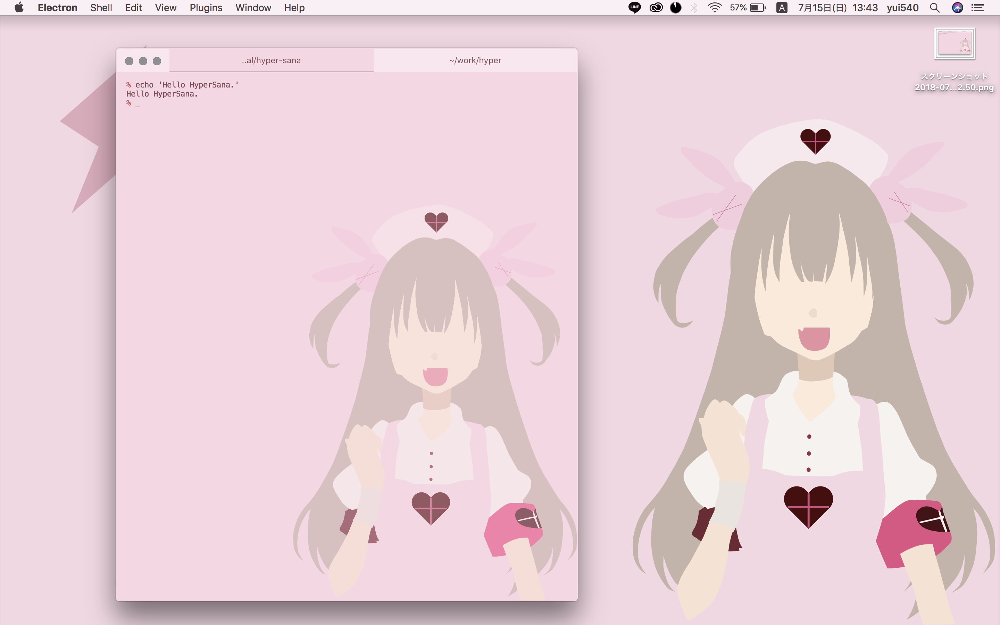

# HyperSana



HyperSanaは、ターミナルエミュレータ「Hyper」のテーマプラグインです。

名取さなの声が出ます。
- 起動時
  - 「おはようございナース！」
- 新規タブ
  - 「ってね」
- タブを閉じる
  - 「やややや」
- コマンドのタイプミス時
  - 「ザーコ」or「えぇ...(ドン引き)」

- 登場するキャラクター
  - 名取さな
  - [YouTubeチャンネル](https://www.youtube.com/channel/UCIdEIHpS0TdkqRkHL5OkLtA)
- さなボイス参照元
  - [さなボタン](http://sanabutton.ojaru.jp/)
- 開発者
  - yui540
  - [Twitter - @yui540](https://twitter.com/yui540)





## 使い方
```bash
$ hyper i hyper-sana
```

## オプション
```js:.hyper.js
config: {
  // ...
  hyperSana: {
    illust: true, // イラストを表示するか（デフォルトは true）
    opacity: 0.3, // イラストの不透明度0~1（デフォルトは0.3）
  },
  // ...
}
```